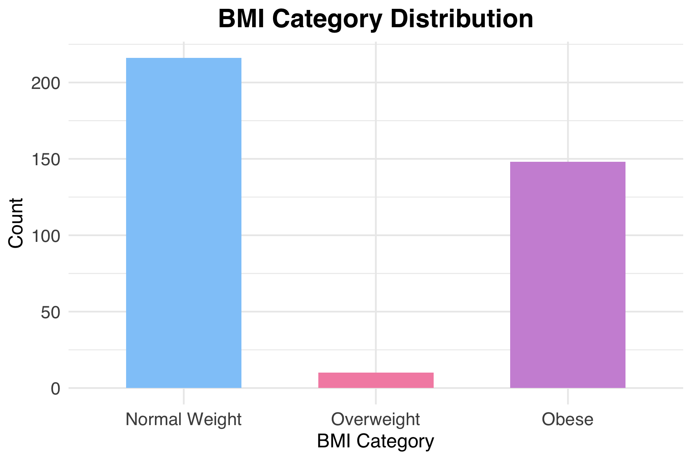

# sleep-health-insights

Analyzing sleep and lifestyle patterns to extract meaningful health insights using R and data visualization.

---

## 📌 Project Overview

Inspired by health tech use cases like Fitbit, this project explores the relationships between sleep quality, lifestyle habits, and health outcomes using a public dataset.  
The goal was to uncover patterns and correlations through a structured analytical process using R.

---

## 📌 Objectives

- 🗂️ Clean and prepare raw data for analysis  
- 📊 Visualize sleep and lifestyle variables using `ggplot2`  
- 📈 Perform correlation analysis (stress, sleep, activity, BMI)  
- 📝 Deliver insights in a clear, structured report

---

## 📌 Tools & Skills

- **Languages**: R  
- **Libraries**: `dplyr`, `ggplot2`, `tidyr`  
- **Skills**: Data cleaning · Exploratory data analysis · Data storytelling · Visual strategy

---

## 📂 Project Files

- `olap_and_data_warehousing.R` — R script for data prep, outlier detection & BMI classification  
- `Report_DataWarehousing.pdf` — final report including methodology, visuals, and key insights

---

## 💡 Sample Visualization

A bar chart showing the distribution of BMI categories in the dataset.

---

## 🌟 Highlights

- Built a clean and structured analytical pipeline  
- Identified data-driven links between sleep and lifestyle  
- Produced a visually clear and insightful final report

---

## 💡 What I Learned

- How to clean and prepare real-world health data using R  
- How to explore correlations between lifestyle factors and health outcomes  
- The importance of storytelling and visual clarity when communicating data-driven insights

---

## 👩🏽‍💻 Contact

Sheila Houmey  
[LinkedIn](https://linkedin.com/in/sheila-houmey) · GitHub: `@softlyshebuilds`
